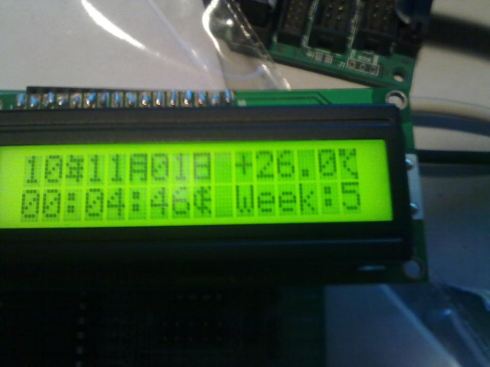
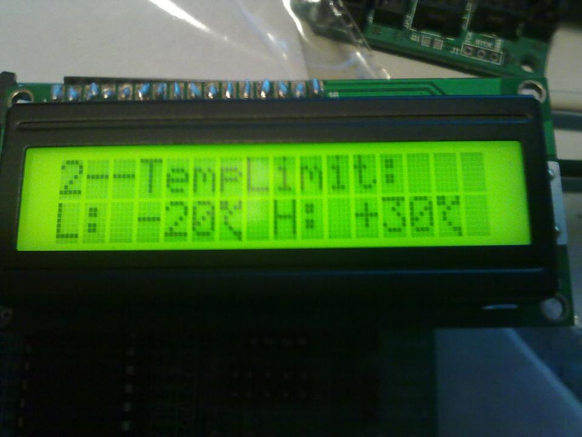
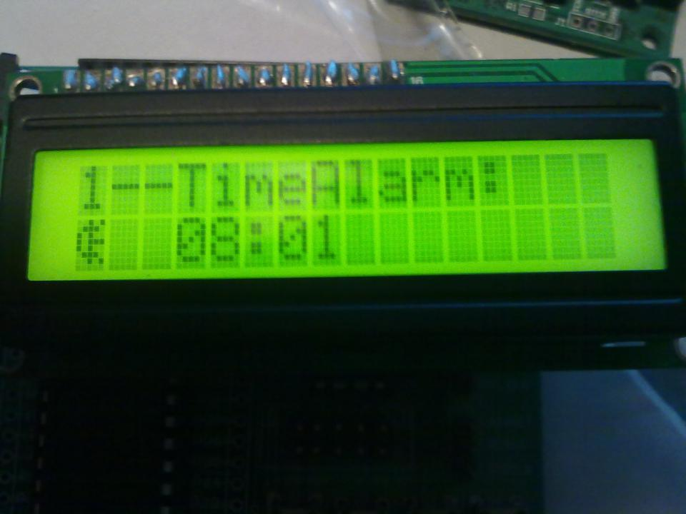
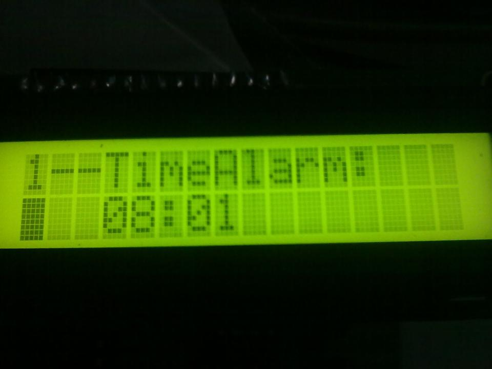
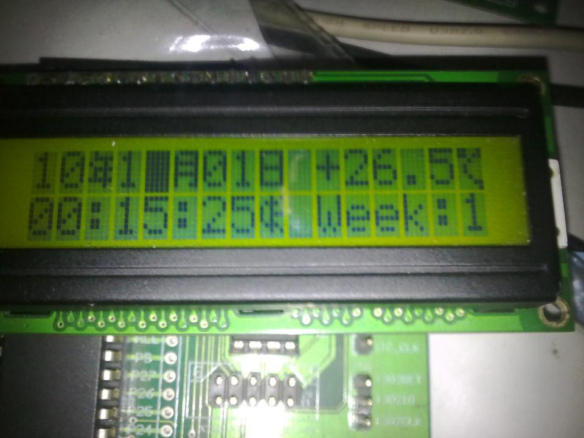
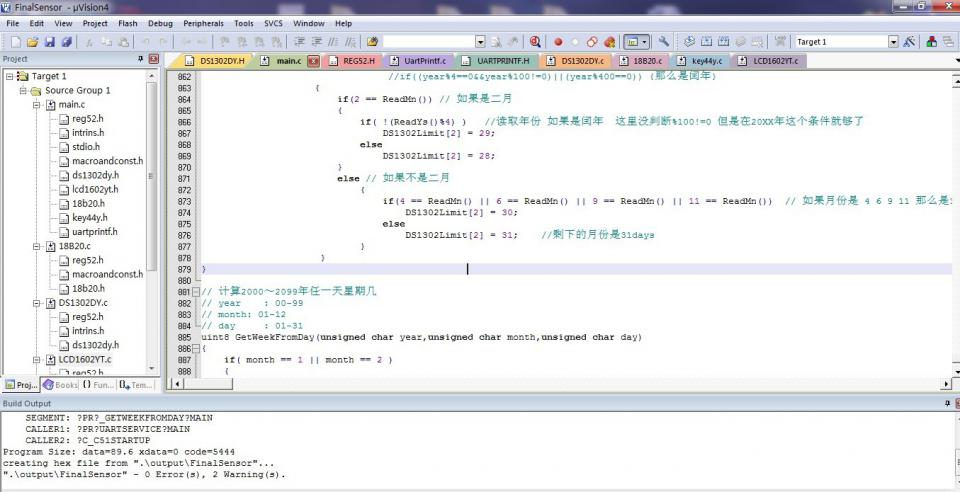
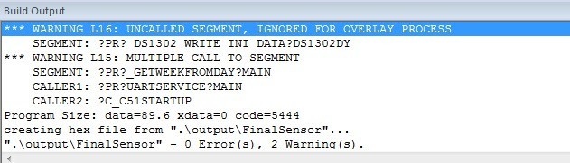

FinalSensor
===========

----------
Abstract In English：

A Small embedded design using 89S52 MCU. Main function: display the calenda and temperature. Also, we can set the alarm for temperature and time through 4X4 matrix keyboard and from PC software.

----------
## 简介：

一个小的用51(STC89C52RC)单片机做的嵌入式设计。可以显示时间和温度，还可以对时间和温度设置报警值报警。

## **功能**： ##
1. 日历
2. 温度
3. 温度报警
4. 闹钟
5. 修改日期时自动更改星期
6. 上位机改变下位机单片机的DS1302时间 闹钟时间  温度报警上下限值
7. 可以通过键盘改变DS1302时间 闹钟时间  温度报警上下限值
8. 改变值时光标会闪   可以控制闹钟的开关并在第一页上显示符号
9. 年月日时分秒的临界值控制  平年闰年对应的二月判断

## 硬件和设计相关： ##
这个是大二上学期做的东西了，流程图和状态机设计框图都弄丢了。对应的原理图为：，Altium Designer格式的原理图和PCB已经丢失。

## 截图说明： ##

对应的上位机在这里，界面截图如下：

